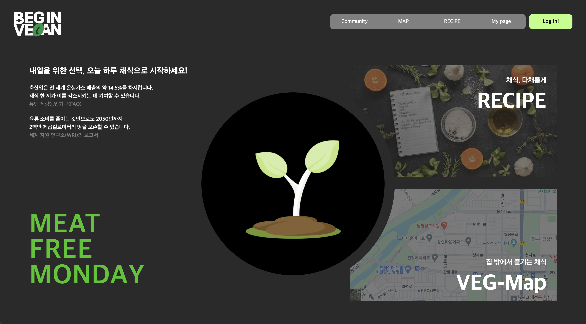
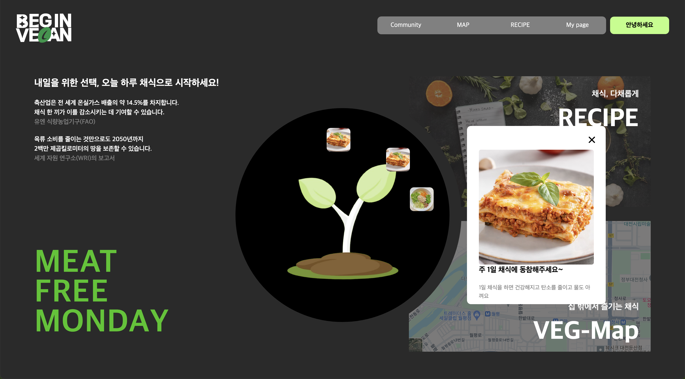
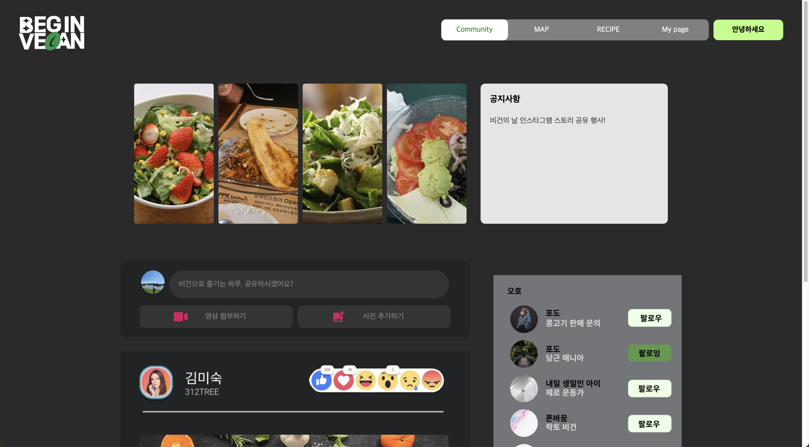
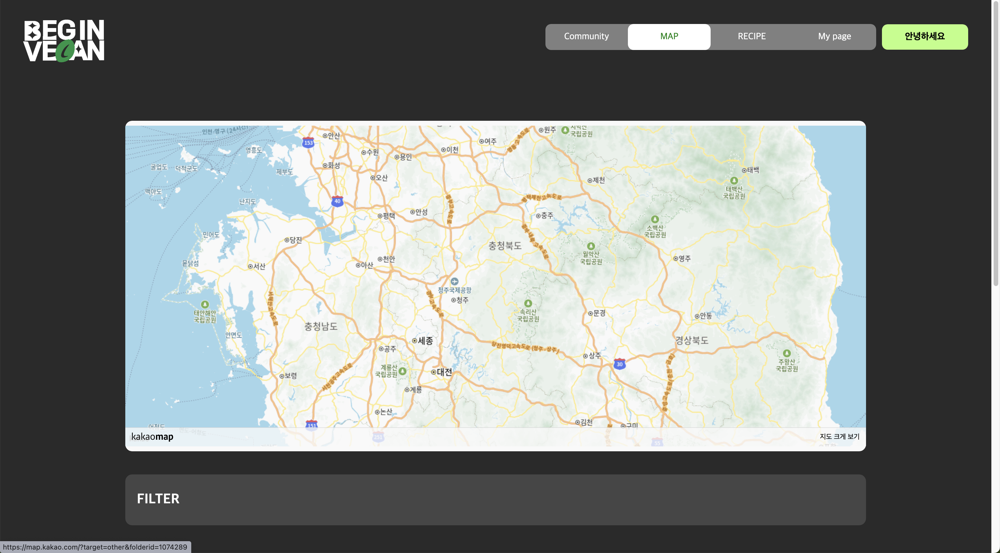
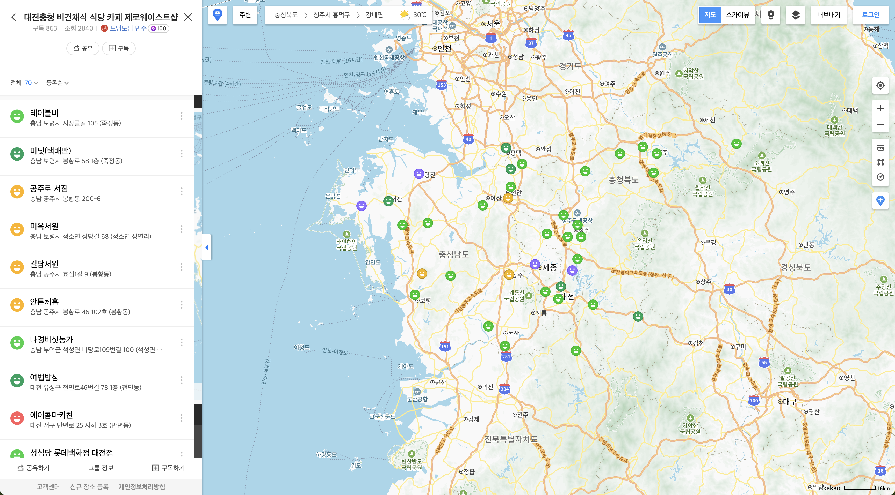
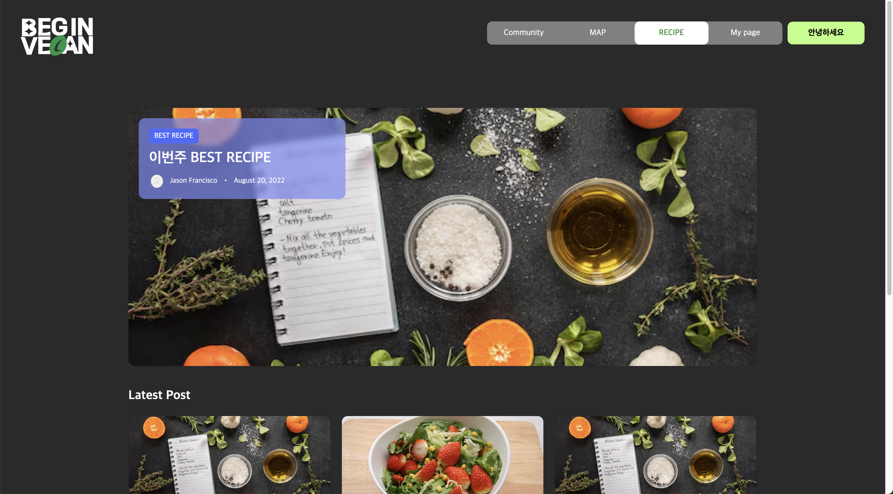
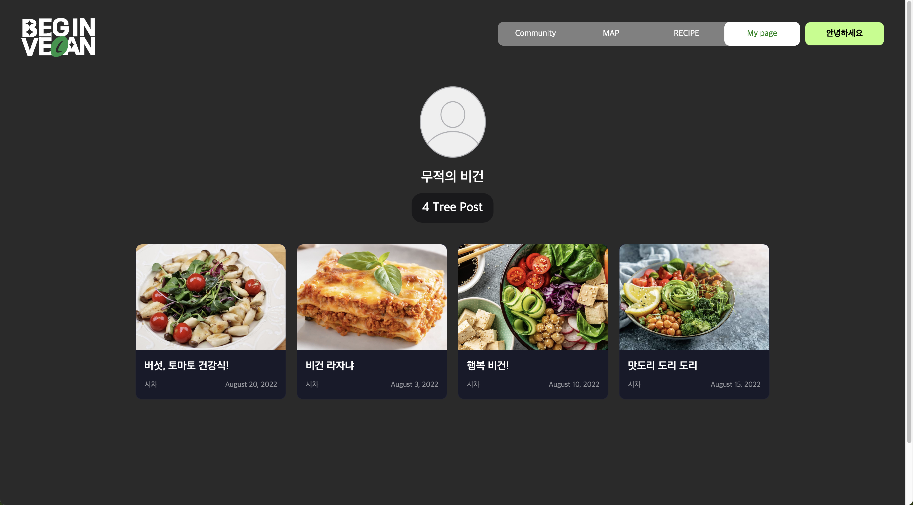
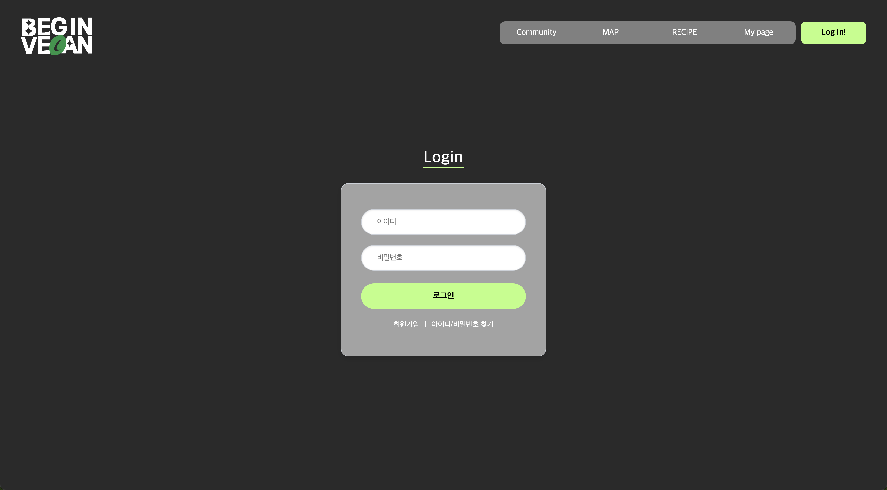

# 2024 GDSC KAIST 여름 해커톤

- 기간: 2024.08.24 ~ 08.25 (개발 시간: 17H)
- 주제: Google Solution Challenge : UN의 17가지 지속 가능한 발전 목표 달성
- [해커톤 상세 정보](https://www.swuniv.kr/notice/?idx=51267867&bmode=view)

 

## 프로젝트 개요

BEGIN VEGAN은 비건 채식을 장려하고 지원하는 웹 플랫폼입니다.  
이 프로젝트는 SDGs(지속가능발전목표)의 "Good Health & Well Being"과 "Climate Action" 문제 해결에 기여하고자 합니다.

 

## 팀 구성 & 기술 스택

- Frontend(2명): React
- Backend(2명): Flask, Supabase

 

## 구현 페이지

### 메인화면

### 메인화면 - 로그인 시

최근 7일 채식 인증 현황 확인 및 클릭 시 상세 보기

  

### 커뮤니티

  

### 근처 비건 식당 찾기

  
  
  지도 클릭 시

### 비건 레시피

  

### 마이페이지

  

\+ 작성한 글의 사진들로 프레임을 끼워 영상 추출

### 로그인

  
